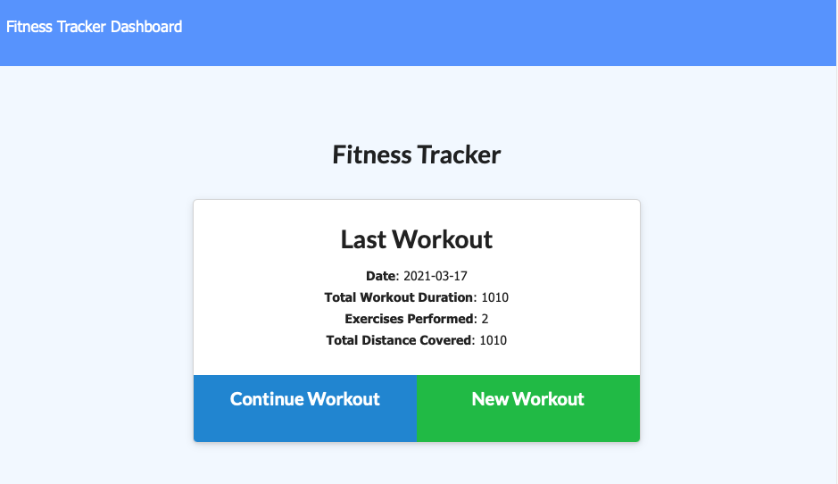
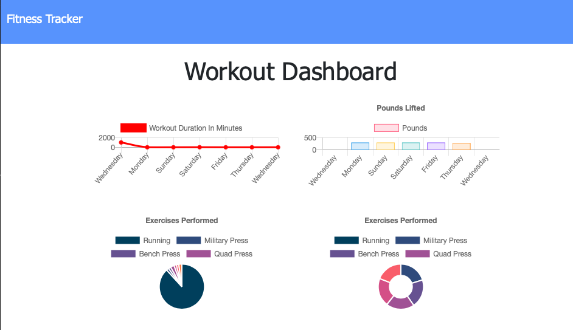
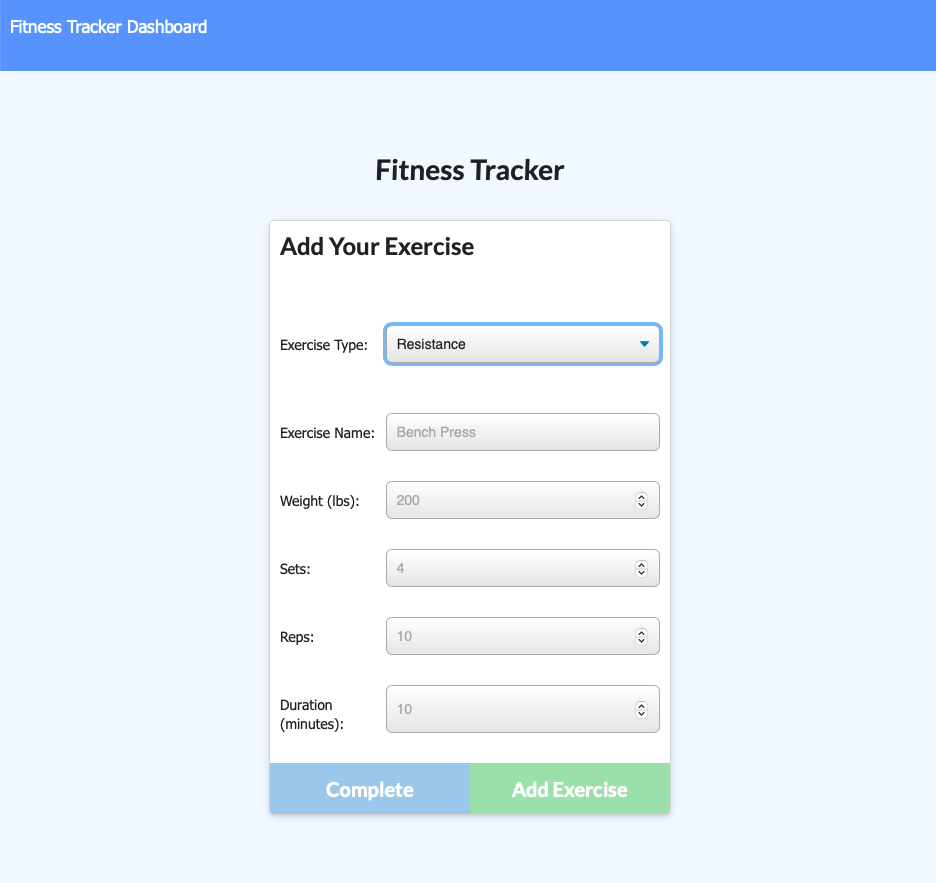
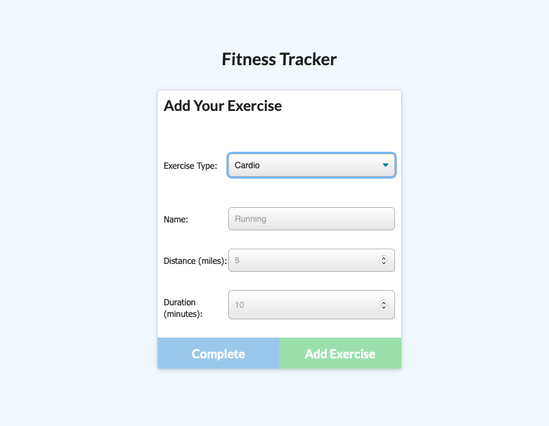

# Workout Tracker 
  

## Table of Contents 
- [Workout Tracker](#workout-tracker)
  - [Table of Contents](#table-of-contents)
  - [Description](#description)
  - [Installation Instructions](#installation-instructions)
  - [Usage](#usage)
  - [Licensing](#licensing)
  - [Contributing](#contributing)
  - [Tests Code](#tests-code)
  - [Images of the Appliication](#images-of-the-appliication)
  - [Access to Functional Applicaton](#access-to-functional-applicaton)
  - [GitHub Direct Link:](#github-direct-link)
  - [Questions](#questions)
    
## Description
    This application is designed to track your workouts.  After each of your workouts you add the type of exercise and its name plus the accompanying details into the tool to keep a running log of your workouts.  The application will track workouts between Cardio and Resistance and store this information to a database.  The information is then retrieved and displayed in a neat dashboard making the data easy to read.
    
## Installation Instructions 
    The application does not require any installation.  It is live and running on heroku which can be accessed using the link below.  Should you want to run locally on your machine please download all the deployed files to your computer.  You will need mongo db with a user name and password.  Following that npm init and install to get things up and running on your local machine before running server.js.

## Usage
    To use this information enter each of your exercises by type and name with the applicable details requested based on extercise type.  The system will track this information for you in a mogo database.
    
## Licensing
      

    
## Contributing
    This application is open to all contribution efforts.
    
## Tests Code
    To test run the applicaiton in heroku.  Add your workout and you should see the home page update with the latest workout and the dashboard should also have record of the workout you added.

## Images of the Appliication
Please find screenshots and a brief video showcasing the application below

## Access to Functional Applicaton

A functioning version of the application can be found here [Heroku](https://bthfitnesstracker.herokuapp.com/stats)

## GitHub Direct Link:  

[Workout-Tracker-GitHub](https://github.com/daze77/workouttracker)

    
## Questions
    
You can find me here on [GitHub](http://github.com/daze77), or contact me via [email](mailto:daze77@gmail.com)  
    